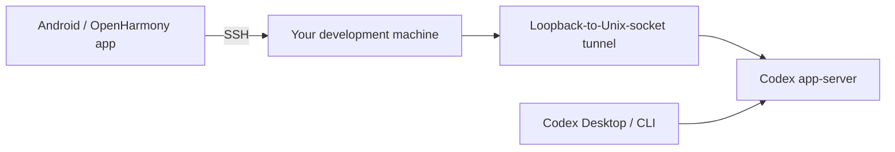

# Android SSH Codex

**Use Codex on your development machine from an Android or OpenHarmony device.**

[](https://github.com/wkj2333666/Android-SSH-Codex/releases/latest)
[](https://github.com/wkj2333666/Android-SSH-Codex/actions/workflows/ci.yml)
[](https://github.com/wkj2333666/Android-SSH-Codex/actions/workflows/build.yml)
[](LICENSE)

Android SSH Codex is a mobile client for a Codex app-server running on a
computer you control. It connects directly over SSH—there is no hosted relay,
no Codex runtime on the phone, and no need to copy your OpenAI credentials into
the app.

> [!NOTE]
> This is an independent community project. It is not affiliated with or
> endorsed by OpenAI.

## What you can do

- Browse tasks by remote project, with unassigned tasks kept out of the way.
- Start new tasks and continue existing Codex Desktop or CLI conversations.
- Follow streaming responses, approvals, tool activity, Markdown, and formulas.
- Choose a server-advertised model and reasoning effort for new turns.
- Send follow-up instructions to a working agent; messages are steered to the
  active turn or queued when the turn is changing state.
- Use `/goal`, `/compact`, `/skills`, `/interrupt`, and remote skill completion.
- Open very long conversations without loading the entire history at once.
- Reconnect automatically to the last host unless you explicitly disconnect.
- Import common OpenSSH configuration, including a one-hop `ProxyJump`.

The app uses a responsive Material 3 interface and supports both phone and
tablet layouts, light and dark themes, password authentication, and pasted
OpenSSH private keys.

## How it works



Codex, source code, provider credentials, and command execution stay on the
remote development machine. The mobile app carries app-server RPC traffic over
an SSH exec channel and renders the resulting tasks and events.

## Requirements

### Mobile device

- Android 8.0 or newer, or a compatible OpenHarmony device.
- Network access to the SSH server.

### Development machine

- A reachable SSH server that allows session and exec channels.
- `/bin/sh`, `base64`, and a writable home directory.
- Codex CLI installed and authenticated on that machine.
- Codex CLI 0.146.0 or newer for automatic **Shared** mode startup. Use a current
  release whenever possible.

The phone does not need the Android SDK, Flutter, Codex credentials, or direct
access to your source repository.

## Install

Download the latest build from
[GitHub Releases](https://github.com/wkj2333666/Android-SSH-Codex/releases/latest):

- `app-arm64-v8a-release.apk` — most current Android phones and tablets.
- `app-armeabi-v7a-release.apk` — older 32-bit Android devices.
- `app-x86_64-release.apk` — x86_64 devices and emulators.
- `android-ssh-codex-ohos-arm64-unsigned.hap` — native OpenHarmony build.

Download `SHA256SUMS-android.txt` or `SHA256SUMS-ohos.txt` with the matching
package, then verify it with:

```bash
sha256sum -c SHA256SUMS-android.txt --ignore-missing
```

Install or update an Android build over ADB with:

```bash
adb install -r app-arm64-v8a-release.apk
```

The Android packages use a retained release certificate and support in-place
upgrades. Builds through `v0.1.4` used temporary CI certificates, so users
upgrading from one of those versions must uninstall it once before installing a
current release.

The native OpenHarmony HAP is unsigned. Devices that require a distributor
certificate and provision profile must have the HAP signed before installation.
HarmonyOS devices with Android compatibility can use the Android APK instead.

## Connect your first host

1. On the development machine, confirm that SSH and Codex work normally:

   ```bash
   codex --version
   codex # Complete sign-in if prompted, then exit.
   ```

2. In the app, open **Hosts**, select **Add SSH host**, and enter the SSH host,
   user, port, and authentication method. Leave the app-server mode on
   **Shared** for the usual Codex Desktop-compatible setup.
3. Connect and compare the displayed SSH host-key fingerprint with the trusted
   fingerprint from your server before accepting it.
4. Open **Tasks**, add a project using its absolute working directory on the
   development machine, and start or resume a task.

The app remembers an intentional connection and reconnects after restart or a
temporary network failure. Using **Disconnect** clears that intent.

## App-server modes

Every saved host has an explicit app-server mode:

| Mode | Use it when | Behavior |
| --- | --- | --- |
| **Shared** | You want the same task state as Codex Desktop or other local clients. | Starts or reuses the Codex-managed daemon for the effective `CODEX_HOME`. This is the default and recommended mode. |
| **Custom** | You already manage an app-server socket. | Connects to an absolute Unix socket path and never starts, restarts, or stops its process. |
| **Isolated** | You want a mobile-only app-server lifecycle. | Manages a separate socket under the remote cache directory and restarts only that app-owned process when its environment changes. |

The selected mode is authoritative. A connection failure never silently falls
back to another daemon or socket.

## SSH configuration

You can paste relevant `~/.ssh/config` contents into the host editor. The
importer understands:

- `Host`, `HostName`, `User`, and `Port`
- `IdentityFile`
- `SetEnv`
- wildcard and negated host patterns
- one-hop `ProxyJump`

An imported `IdentityFile` path is only a hint: the file usually exists on the
computer where the SSH config came from, not on the phone. Paste the key into
the host profile or use password authentication.

Environment variables can be entered under **Advanced SSH**, one `NAME=value`
assignment per line. The SSH server must allow each requested name with
`AcceptEnv`. For example:

```text
# Mobile host profile
MY_VARIABLE=value
```

```text
# Remote sshd_config
AcceptEnv MY_VARIABLE
```

Reload the SSH server after changing `sshd_config`. If a name is rejected, the
app reports the required `AcceptEnv` entry without revealing the configured
value. Arbitrary OpenSSH directives are not executed by the app.

## Security and privacy

- All app-server traffic travels directly through your SSH connection.
- Host keys are pinned on first use; a changed key produces a hard warning.
- Passwords, private keys, and fingerprints use platform secure storage.
- The app never requests or stores OpenAI provider credentials.
- SSH input and Codex RPC input are not written to application logs.
- Isolated-mode reuse stores only a SHA-256 environment fingerprint, not the
  environment values themselves.

Please report vulnerabilities privately as described in
[SECURITY.md](SECURITY.md). Do not post credentials, private keys, hostnames, or
app-server traffic in public issues.

## Troubleshooting

### The SSH connection works, but Codex does not connect

Update Codex on the development machine and confirm that the selected mode is
available. For **Shared** mode, Codex CLI 0.146.0 or newer is required to start
the managed daemon. For **Custom** mode, verify that the configured absolute
Unix socket exists and belongs to a running app-server.

### The server rejects an environment variable

Either remove it from **Advanced SSH** or add its name to `AcceptEnv` in the
server's `sshd_config`. Configure names only—never put secret values in
`sshd_config`.

### The host key changed

Do not accept the new fingerprint until you have verified the change through a
trusted channel. An unexpected key change can indicate a rebuilt server, a DNS
or address change, or an interception attempt.

### Collect Android logs

Reproduce the problem, then run:

```bash
adb logcat -d -v threadtime \
  | grep -E 'Connection failed during|Remote Codex Unix tunnel failed|I/flutter'
```

Remove hostnames and any other private information before attaching logs to an
issue. The app intentionally avoids logging SSH and RPC input.

If the problem persists,
[open an issue](https://github.com/wkj2333666/Android-SSH-Codex/issues) with
the app version, phone OS, Codex CLI version, selected app-server mode, and
sanitized logs.

## Current boundaries

Android SSH Codex is a remote Codex workspace, not a complete mobile
development environment. It does not:

- run Codex or shell commands locally on the phone;
- provide a source-code editor or Git hosting client;
- proxy traffic through a project-operated cloud service;
- support multi-hop `ProxyJump` chains;
- sign the native OpenHarmony HAP.

## Build and contribute

Issues and pull requests are welcome. Please read
[CONTRIBUTING.md](CONTRIBUTING.md) before making broad product or protocol
changes.

GitHub Actions is the authoritative build environment. It runs formatting,
analysis, tests, Android builds, Android signature verification, and
OpenHarmony builds. See [docs/BUILDING.md](docs/BUILDING.md) for pinned
toolchains, build outputs, and release-signing details.

## License

Android SSH Codex is available under the [MIT License](LICENSE).
