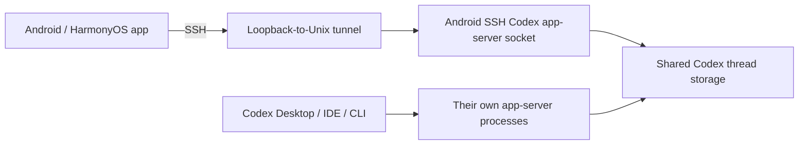

# Android SSH Codex

Android SSH Codex is a mobile Codex UI for Android and OpenHarmony/HarmonyOS.
Codex stays on your development machine; the app connects through SSH, starts a
namespaced persistent app-server, and renders its threads, turns, approvals, and
streamed activity in a mobile workspace.

## Scope

- Android 8+ APK/AAB and OpenHarmony arm64 HAP builds.
- Password and pasted OpenSSH private-key authentication.
- `~/.ssh/config` import for `Host`, `HostName`, `User`, `Port`, `IdentityFile`,
  wildcards, negated patterns, and one-hop `ProxyJump`.
- Trust-on-first-use host-key pinning with hard mismatch warnings.
- Existing and running remote Codex tasks, search, history, streaming output,
  new/resumed turns, interrupt, and approvals.
- Race-safe snapshot/event merging and read-only display for tasks currently
  owned by Codex Desktop, an IDE, the CLI, or another mobile client.

It does not run Codex on the phone, proxy traffic through a cloud service, store
OpenAI credentials, provide a source editor, or manage Git hosting.

## How it coexists with Codex Desktop

The app-owned endpoint is always
`~/.cache/android-ssh-codex/app-server.sock` (or the matching XDG cache path).
Startup uses an atomic directory lock and never sends process signals. Other
Codex app-server sockets are outside this namespace and are never touched.

Task refreshes and live notifications pass through one reducer with connection
epochs, refresh generations, and event revisions. A running thread is writable
only when this device previously created or resumed it and the app-owned server
still reports it loaded. Every other running thread remains visible and read-only.

## Install and connect

1. Download the APK or HAP and its checksum from
   [Releases](https://github.com/wkj2333666/Android-SSH-Codex/releases).
2. On the remote host, install and authenticate a current Codex CLI.
3. Add a host manually or paste relevant `~/.ssh/config` contents.
4. Attach the private key text or password. Imported `IdentityFile` paths are
   hints because those files live on the machine from which the config came.
5. Connect, verify the presented SSH fingerprint, then open or create a task.

Secrets and pinned fingerprints use the platform secure-storage implementation.
SSH and Codex RPC input are not logged by the app.

## Development

See [the product design](docs/superpowers/specs/2026-07-31-android-ssh-codex-design.md),
[implementation plan](docs/superpowers/plans/2026-07-31-android-ssh-codex.md),
and [build guide](docs/BUILDING.md).

All builds and tests run on GitHub Actions. This repository is MIT licensed.

